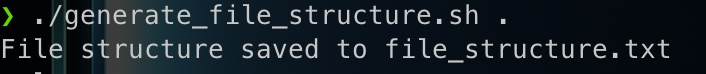
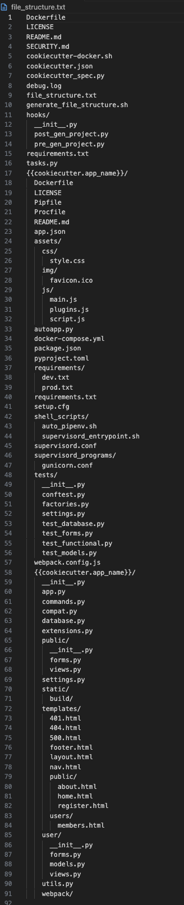

# Useful Shell Scripts

A collection of useful shell scripts for various tasks.

## Table of Contents

1. [Generate File Structure](#generate-file-structure)
2. [Adding More Scripts](#adding-more-scripts)
3. [Contribution](#contribution)

---

## Generate File Structure

This script maps and prints the file structure of a given directory into a text file. It simplifies the process of analyzing the directory structure for testing or documentation purposes.

[View Script](scripts/generate_file_structure.sh)

### Usage

To use the `generate_file_structure.sh` script, follow these steps:

1. **Navigate to the Directory**: Open your terminal and navigate to the directory you want to map and make a `.txt` with the script - [View Script](scripts/generate_file_structure.sh) inside of this directory  where the `generate_file_structure.sh` script is located. For example:

    ```sh
    cd path/to/your/repository
    ```
<br>

2. **Make the Script Executable**: Ensure the script has execute permissions with the following command:

    ```sh
    chmod +x generate_file_structure.sh
    ```

    

<br>

3. **Run the Script**: Use the following command to execute the script, replacing `<directory>` with the path to the directory you want to analyze or using `.` to reference your current directory:

    ```sh
    ~ generate_file_structure.sh <directory>
    ```


    
<br>

4. **Confirm File Creation**: After the script completes, check that the `file_structure.txt` file has been created successfully in your directory.
   
    
<br>

5. **View the Output**: After running the script, it will create a file named `file_structure.txt` in the current directory. This file contains the hierarchical structure of the specified directory.

    
<br>

6. **Check the Debug Log**: The script also generates a `debug.log` file, which logs each directory and file processed during execution. This can be helpful for troubleshooting.

### Example

In the example above, we used the [cookiecutter-flask repository](https://github.com/cookiecutter-flask/cookiecutter-flask) to demonstrate how to generate a text file containing the file structure. We recommend using your preferred visual editor to view the `.txt` file and examine the file structure.

We hope this script proves useful for debugging, documentation, and any other creative applications you can think of.
